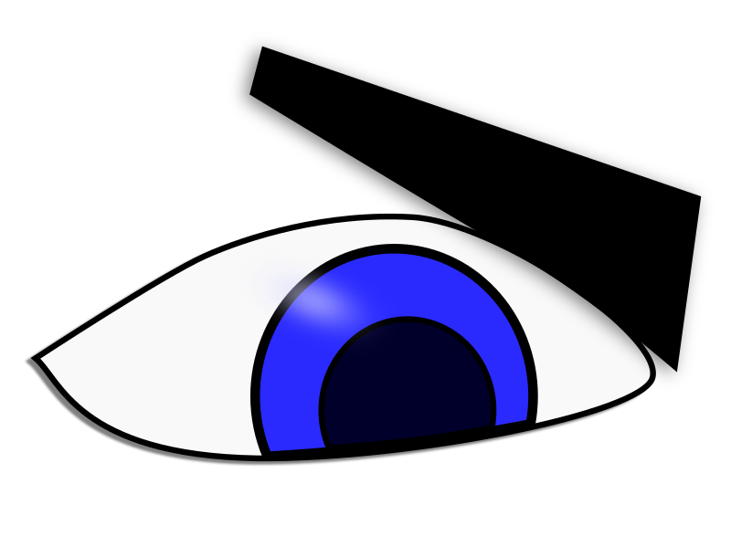

	

Satsuki is a web application for photo organizing and basic
editing.  
It supports the same formats of your browser, but this
limitation can be overcome.

It's made in Typescript, by a programmer not so good with logos, but a
little better with code

## How do I use?

 - Clone this repo
 - `npm install`
 - `npm build-dev`, to build webpack in dev mode
 - If you have [`npx`](https://github.com/zkat/npx "NPX link")
   installed, simply run `npx webpack-serve` to run a test server. If
   not, ~~install NPX~~ run `node_modules/webpack-serve/cli.js`.
   
 Currently that's not much to use, but I promise it will be better.

## Current tasks

Currently, we need to finish the "backend" and integrate it with the
frontend.

